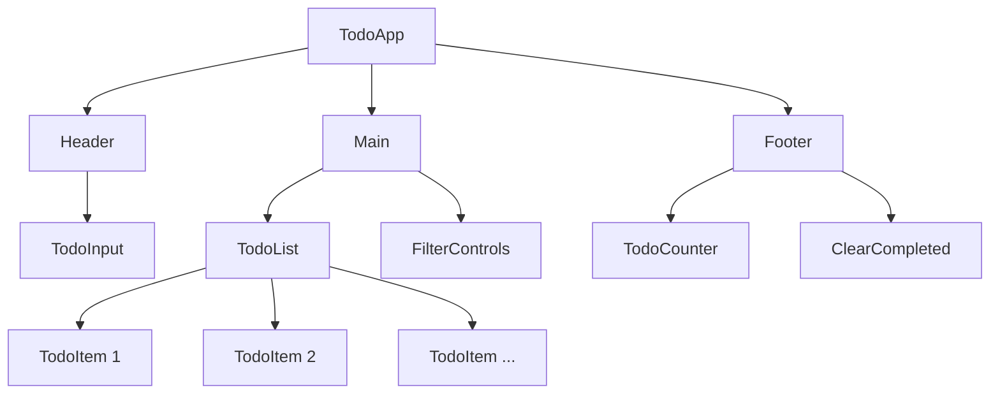

# TODO Application Design Document

## Overview

A simple, frontend-only TODO application built with vanilla HTML, CSS, and JavaScript. The application will run entirely in the browser with no backend dependencies, using localStorage for data persistence.

### Key Features
- Add new TODO items
- Mark items as complete/incomplete
- Edit existing TODO items
- Delete TODO items
- Filter todos (All, Active, Completed)
- Clear all completed items
- Persistent storage using localStorage
- Responsive design for mobile and desktop

### Target Users
- Individuals looking for a simple task management tool
- Users who prefer offline-capable applications
- Anyone needing basic TODO functionality without account setup

## Technology Stack & Dependencies

### Core Technologies
- **HTML5**: Semantic markup structure
- **CSS3**: Styling with modern features (Grid, Flexbox, CSS Variables)
- **Vanilla JavaScript (ES6+)**: Application logic and DOM manipulation
- **localStorage API**: Client-side data persistence

### Browser Support
- Modern browsers supporting ES6+ features
- Chrome 60+, Firefox 55+, Safari 12+, Edge 79+

### No External Dependencies
- No frameworks or libraries required
- Self-contained application
- Works offline after initial load

## Component Architecture

### Application Structure
```
TODO App
├── Header Component
│   ├── App Title
│   └── Add Todo Input
├── Main Content
│   ├── Todo List Container
│   │   └── Todo Item Components
│   └── Filter Controls
└── Footer Component
    ├── Todo Counter
    └── Clear Completed Button
```

### Component Definition

#### TodoApp (Main Application)
**Purpose**: Root application container managing global state
**Responsibilities**:
- Initialize application
- Manage todo data state
- Handle localStorage operations
- Coordinate between components

#### TodoInput Component
**Purpose**: Handle new todo creation
**Properties**:
- Input field for todo text
- Add button/Enter key handler
**Events**:
- `onTodoAdd(text)`: Triggered when new todo is added

#### TodoList Component
**Purpose**: Display and manage the list of todos
**Properties**:
- Array of todo items
- Current filter state
**Methods**:
- `renderTodos()`: Update DOM with current todos
- `filterTodos(filter)`: Apply filter to todo list

#### TodoItem Component
**Purpose**: Individual todo item representation
**Properties**:
- `id`: Unique identifier
- `text`: Todo content
- `completed`: Boolean completion status
- `isEditing`: Boolean edit mode status
**Events**:
- `onToggle(id)`: Toggle completion status
- `onEdit(id)`: Enter edit mode
- `onUpdate(id, newText)`: Update todo text
- `onDelete(id)`: Delete todo item

#### FilterControls Component
**Purpose**: Navigation and filtering interface
**Properties**:
- Current active filter
- Available filter options: ['all', 'active', 'completed']
**Events**:
- `onFilterChange(filter)`: Change active filter

### Component Hierarchy


### Props/State Management

#### Global Application State
```javascript
const appState = {
  todos: [
    {
      id: 'uuid',
      text: 'Learn JavaScript',
      completed: false,
      createdAt: timestamp
    }
  ],
  currentFilter: 'all', // 'all' | 'active' | 'completed'
  editingId: null
};
```

#### State Management Pattern
- **Single Source of Truth**: All state managed in main TodoApp
- **Unidirectional Data Flow**: State flows down, events bubble up
- **Immutable Updates**: Create new state objects for updates
- **localStorage Sync**: Automatically persist state changes

### Lifecycle Methods/Hooks

#### Application Initialization
1. **DOMContentLoaded Event**: Initialize application
2. **loadFromStorage()**: Restore saved todos from localStorage
3. **renderApp()**: Initial DOM rendering
4. **attachEventListeners()**: Bind event handlers

#### State Update Cycle
1. **User Action**: Click, input, keyboard event
2. **Event Handler**: Process user action
3. **State Update**: Modify application state
4. **Persistence**: Save to localStorage
5. **Re-render**: Update affected DOM elements

## Routing & Navigation

### Hash-based Routing
Since this is a single-page application, we'll use hash-based routing for filter navigation:

- `#/` or `#/all`: Show all todos
- `#/active`: Show only incomplete todos
- `#/completed`: Show only completed todos

### Navigation Implementation
```javascript
// Hash change handler
window.addEventListener('hashchange', handleRouteChange);

function handleRouteChange() {
  const hash = window.location.hash;
  const filter = hash.replace('#/', '') || 'all';
  updateFilter(filter);
}
```

## Styling Strategy

### CSS Architecture
- **BEM Methodology**: Block, Element, Modifier naming convention
- **CSS Custom Properties**: For theming and consistent spacing
- **Mobile-First Approach**: Responsive design starting from mobile
- **CSS Grid & Flexbox**: Modern layout techniques

### CSS Structure
```
styles/
├── reset.css          # CSS reset/normalize
├── variables.css      # CSS custom properties
├── base.css          # Base styles and typography
├── components.css    # Component-specific styles
└── utilities.css     # Utility classes
```

### Design System

#### Color Palette
```css
:root {
  --color-primary: #007bff;
  --color-success: #28a745;
  --color-danger: #dc3545;
  --color-warning: #ffc107;
  --color-light: #f8f9fa;
  --color-dark: #343a40;
  --color-border: #dee2e6;
}
```

#### Typography Scale
```css
:root {
  --font-size-sm: 0.875rem;
  --font-size-base: 1rem;
  --font-size-lg: 1.125rem;
  --font-size-xl: 1.25rem;
  --line-height-base: 1.5;
}
```

#### Spacing System
```css
:root {
  --spacing-xs: 0.25rem;
  --spacing-sm: 0.5rem;
  --spacing-md: 1rem;
  --spacing-lg: 1.5rem;
  --spacing-xl: 2rem;
}
```

## State Management

### Local Storage Strategy

#### Data Persistence
- **Key**: `todoApp_todos`
- **Format**: JSON string of todos array
- **Auto-save**: Every state change triggers localStorage update
- **Data Validation**: Validate loaded data structure

#### Storage Operations
```javascript
// Save todos to localStorage
function saveTodos(todos) {
  try {
    localStorage.setItem('todoApp_todos', JSON.stringify(todos));
  } catch (error) {
    console.error('Failed to save todos:', error);
  }
}

// Load todos from localStorage
function loadTodos() {
  try {
    const stored = localStorage.getItem('todoApp_todos');
    return stored ? JSON.parse(stored) : [];
  } catch (error) {
    console.error('Failed to load todos:', error);
    return [];
  }
}
```

### State Update Patterns

#### Immutable Updates
```javascript
// Add new todo
function addTodo(text) {
  const newTodo = {
    id: generateId(),
    text: text.trim(),
    completed: false,
    createdAt: Date.now()
  };
  
  appState.todos = [...appState.todos, newTodo];
  saveTodos(appState.todos);
  renderTodos();
}

// Toggle todo completion
function toggleTodo(id) {
  appState.todos = appState.todos.map(todo =>
    todo.id === id ? { ...todo, completed: !todo.completed } : todo
  );
  saveTodos(appState.todos);
  renderTodos();
}
```

## API Integration Layer

### Local Storage as Data Layer
Since this is a frontend-only application, localStorage serves as our data persistence layer:

#### CRUD Operations
- **Create**: Add new todo to array and save
- **Read**: Load todos from localStorage on app initialization
- **Update**: Modify todo properties and save
- **Delete**: Remove todo from array and save

#### Data Validation
```javascript
function validateTodo(todo) {
  return (
    todo &&
    typeof todo.id === 'string' &&
    typeof todo.text === 'string' &&
    typeof todo.completed === 'boolean' &&
    typeof todo.createdAt === 'number'
  );
}
```

#### Error Handling
- Handle localStorage quota exceeded
- Graceful degradation when localStorage unavailable
- Data corruption recovery

## Testing Strategy

### Unit Testing Approach
While keeping the project simple, consider basic testing strategies:

#### Manual Testing Checklist
- ✅ Add new todo item
- ✅ Mark todo as complete/incomplete
- ✅ Edit existing todo
- ✅ Delete todo item
- ✅ Filter by status (all/active/completed)
- ✅ Clear completed items
- ✅ Data persistence across browser sessions
- ✅ Responsive design on different screen sizes
- ✅ Keyboard navigation and accessibility

#### Browser Testing
- Test core functionality across target browsers
- Verify localStorage behavior
- Check responsive design breakpoints
- Validate accessibility features

### Testing Tools (Optional)
If you want to add automated testing later:
- **Jest**: For unit testing JavaScript functions
- **Cypress**: For end-to-end testing
- **Lighthouse**: For performance and accessibility audits

### Performance Considerations
- Minimize DOM manipulation frequency
- Use document fragments for batch updates
- Debounce rapid user inputs
- Optimize for mobile performance

### Accessibility Features
- Semantic HTML structure
- ARIA labels and roles
- Keyboard navigation support
- Screen reader compatibility
- Color contrast compliance

### Browser Compatibility
- Progressive enhancement approach
- Fallbacks for unsupported features
- Graceful degradation for older browsers
- localStorage availability detection